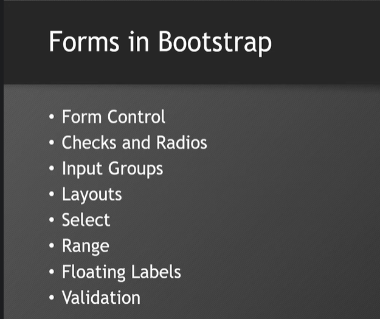

# Forms
 *form-lable
 *form-control
 *btn btn-primary - btn-dark

 # Form-Control
  *row (textarea)
  *form-control-sm
  *form-control-lg
  *form-control-md
  *detalistOptions

# Check and Radio
  *form-check-input
  *form-check-label
  *form-check-inline
  *form-check-reverse

# Range
  *form-range
  *min
  *max

